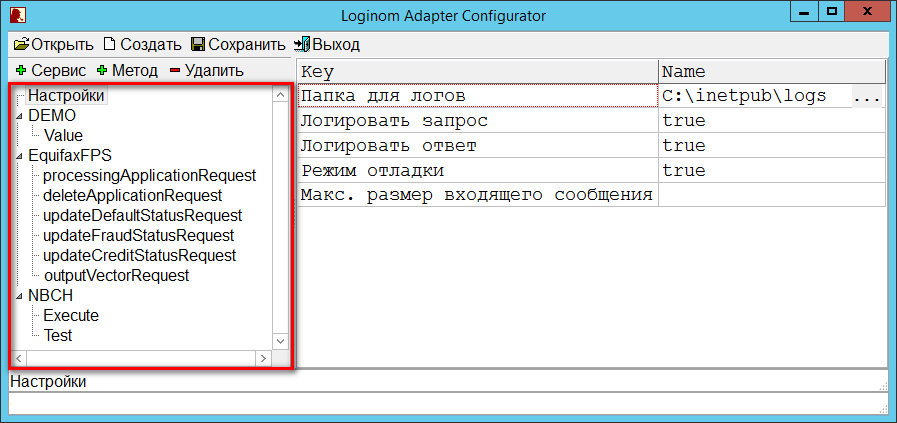

# Конфигурация Loginom Adapter

## Loginom Adapter Configurator

Настройки Loginom Adapter хранятся в xml-файле [Web.config](https://ru.wikipedia.org/wiki/Web.config), редактирование которого осуществляется программой **Loginom Adapter Configurator** (далее по тексту *Конфигуратор*). При установке по умолчанию *Конфигуратор* находится в папке `C:\inetpub\wwwroot\LoginomAdapter\Configurator\`.

При сохранении настроек *Конфигуратор* перезаписывает файл `Web.config`. При этом запросы, полученные *Адаптером* до этого, будут завершены со старыми настройками. Последующие запросы к *Адаптеру* будут выполнены с учетом новых настроек.

Интерфейс *Конфигуратора* состоит из двух панелей. На левой панели окна *Конфигуратора* располагается дерево навигации (см. рисунок 3), отображающее структуру настроек, на правой — сами настройки.

Дерево навигации представляет собой двухуровневую иерархическую структуру и включает в себя следующие элементы:

* Элементы первого (корневого) уровня:
  * Корневой элемент `Настройки`. Содержит параметры общих настроек *Адаптера*, представленных в разделе [Параметры общих настроек](./parameters.md#parametry-obschikh-nastroek).
  * Корневые элементы, обозначающие внешние сервисы, с которыми осуществляется взаимодействие (в конфигурации, представленной на рисунке 3, присутствуют три таких элемента: `DEMO`, `EquifaxFPS` , `NBCH`). Содержат параметры настроек, представленных в разделе [Параметры настроек подключения к внешним сервисам](./parameters.md#parametry-nastroek-podklyucheniya-k-vneshnim-servisam).
* Элементы второго уровня:
  * Методы, по которым осуществляется взаимодействие с соответствующими внешними сервисами, представлены подчиненными элементами с наименованиями методов (на рисунке 3 это элементы: `Value`, `processingApplicationRequest`, `deleteApplicationRequest` и другие). Содержат параметры настроек, представленных в разделе [Параметры настроек методов взаимодействия с внешними сервисами](./parameters.md#parametry-nastroek-metodov-vzaimodeystviya-s-vneshnimi-servisami).

Подобная структура предполагает, что внешних сервисов, с которыми работает *Адаптер*, может быть несколько, и для каждого внешнего сервиса может быть определено несколько методов.

## Дополнительные файлы

Помимо предустановленных в процессе инсталляции папок и файлов, в процессе настройки *Адаптера* в каталоге установки могут быть размещены дополнительные файлы (сертификаты, XSD-схемы и т.п.), необходимые для работы с внешними сервисами.

Вместе с *Адаптером* могут поставляться настройки подключений (коннекторы) к таким внешним сервисам, как, например, [EquifaxFPS](https://www.equifax.ru), *NationalHunter*, [Национальное бюро кредитных историй](https://www.nbki.ru/) (НБКИ), [Бюро кредитных историй — Объединенное Кредитное Бюро](https://bki-okb.ru) (БКИ — ОКБ), [QiwiScoring](https://corp.qiwi.com/business/banks/scoring.action) и другим. Как правило, дополнительные файлы этих настроек размещаются в подкаталогах *Data* и *Certificates* каталога установки (по умолчанию это `C:\inetpub\wwwroot\LoginomAdapter\`). В файле `Web.config` при этом будут содержаться ссылки на эти файлы.

В файле `Web.config` допустимо использование как абсолютных путей на дополнительные файлы (с указанием буквы диска), так и относительных, которые задаются относительно расположения `Web.config`.

> Примечание: рекомендуется помещать дополнительные файлы в папку, в которой установлен *Адаптер*, а в файле конфигурации `Web.config` указывать к ним относительные пути. Это позволяет переносить *Адаптер* с одного компьютера на другой простым копированием папки с минимальным количеством перенастроек.
