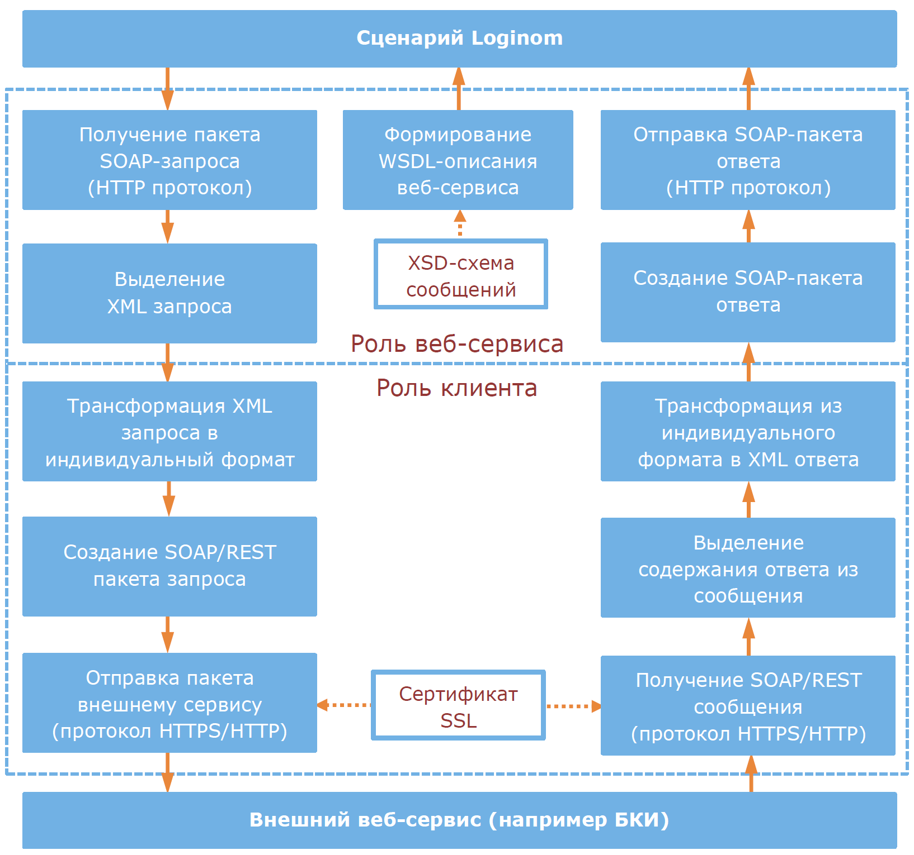
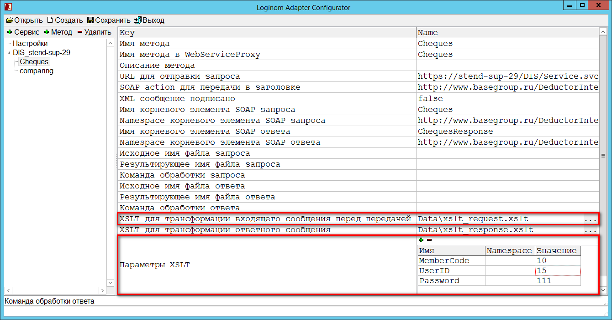

# Принципы работы и настройки

## Функциональная схема работы

Являясь промежуточным веб-сервисом, адаптер одновременно выполняет роль клиента по отношению к внешнему сервису (например, к бюро кредитных историй – БКИ) и роль SOAP-веб-сервиса по отношению к сценарию Loginom (или любому другому стороннему потребителю информации). Выполняя роль веб-сервиса, адаптер предоставляет WSDL-описание в соответствии со стандартом SOAP. WSDL-описание однозначно определяет параметры взаимодействия с веб-сервисом, в том числе и форматы XML-сообщений, посредством которых это взаимодействие осуществляется. С другой стороны, выполняя роль клиента, адаптер обеспечивает трансформацию этих сообщений из формата SOAP в индивидуальные форматы внешних сервисов и обратно.

Функциональная схема работы адаптера представлена на рисунке 4.0.



## Настройка роли клиента внешних сервисов

Алгоритм действий на этапе отправки запроса внешнему сервису представлен на рисунке 4.1


Как видно из рисунка 4.1, первым действием после получения SOAP-запроса из сценария Loginom является выделение текста xml-запроса из SOAP-пакета. Согласно описанию SOAP-протокола, xml-запрос к веб-сервису содержится в теле узла «Body» SOAP-пакета. Пример SOAP-пакета приведен ниже:

```
<soapenv:Envelope xmlns:soapenv="http://schemas.xmlsoap.org/soap/envelope/" xmlns:li="http://www.basegroup.ru/LoginomIntegrator">
<soapenv:Header/>
    <soapenv:Body>
        <li:Cheques>
            <variables>
                <DateMin>2000-06-06T23:59:00</DateMin>
                <DateMax>2017-06-06T23:59:00</DateMax>
            </variables>
        </li:Cheques>
    </soapenv:Body>
</soapenv:Envelope>
```
Для приведенного примера из SOAP-пакета будет выделен узел «li:Cheques», и дальнейшая трансформация на следующих этапах будет производиться с текстом xml:

```
<li:Cheques>
    <variables>
        <DateMin>2000-06-06T23:59:00</DateMin>
        <DateMax>2017-06-06T23:59:00</DateMax>
    </variables>
</li:Cheques>
```
Первым этапом преобразования XML запроса может быть XSLT трансформация. Настройка выполнения этого этапа производится с помощью параметров конфигуратора *XSLT для трансформации входящего сообщения перед передачей* и *Параметры XSLT*, представленных на рисунке 4.2.



Параметр *XSLT для трансформации входящего сообщения перед передачей* содержит путь к скрипту xslt. В самом скрипте xslt могут быть определены входные параметры, как это показано в следующем примере:

```
<?xml version="1.0" encoding="UTF-8"?>
<xsl:stylesheet version="1.0" xmlns:xsl="http://www.w3.org/1999/XSL/Transform" xmlns:fo="http://www.w3.org/1999/XSL/Format">
<xsl:output method="xml" version="1.0" encoding="UTF-8" indent="yes"/>
<xsl:param name="MemberCode"/>
<xsl:param name="UserID"/>
<xsl:param name="Password"/>
<xsl:template match="@* | node()">
<xsl:copy>
<xsl:apply-templates select="@* | node()"/>
. . . .
</xsl:stylesheet>
```

Здесь в теле скрипта описаны параметры «MemberCode», «UserID», «Password», принимающие значения, заданные в WSP Configurator.

Если значение параметра *XSLT для трансформации входящего сообщения перед передачей* не задано, то этап XSLT трансформации не выполняется.

Следующим этапом может быть преобразование в особый формат сообщения БКИ «ОКБ». Данное преобразование специфично для работы с вышеуказанным БКИ и в других задачах не применяется. Настройка выполнения этого этапа осуществляется параметром *Особый формат сообщения*.

Следующим этапом обработки может быть применение команды ОС (операционной системы). Выполнение этого этапа определяется параметрами конфигуратора: *Исходное имя файла запроса*, *Результирующее имя файла запроса*, *Команда обработки файла запроса*. Пример команды:

```
"C:\Program Files\7-Zip\7z" a -tzip "%outputFile%" "%inputFile%"
```

Здесь шаблоны *%inputFile%* и *%outputFile%* при выполнении команды заменяются на значения параметров *Исходное имя файла запроса* и *Результирующее имя файла запроса* соответственно. В этих параметрах могут быть заданы полные пути к файлам, либо только имена файлов. При отсутствии полного пути файлы будут располагаться в папке с Web.config. Перед началом выполнения команды ОС результат предыдущих этапов преобразования представляется в виде файла с именем, указанным в параметре «Исходное имя файла запроса», и записывается на диск. Далее команда ОС применяется к этому файлу и формирует выходной файл. Содержание выходного файла передается на следующий этап обработки.

В случае если значения параметров *Исходное имя файла запроса* и *Результирующее имя файла запроса* не заданы, то будут сформированы имена файлов на основе случайно сгенерированных GUID (Globally Unique Identifier) без расширения. Эти временные файлы так же будут располагаться в папке с Web.config и по окончании обработки удаляются.

Имена файлов так же можно задавать в виде шаблона с использованием конструкции *%guid%*.
Пример: "%guid%_reg.xml". Вместо *%guid%* в имя файла будет подставлен случайно сгенерированный GUID.
Эти правила выполнения этапа применяются и при преобразовании *Команда OC* ответов сервиса с использованием параметров *Исходное имя файла ответа*, *Результирующее имя файла ответа*, *Команда обработки файла ответа*.
Если параметр *Команда обработки файла запроса* не задан, то этап обработки *Команда OC* не выполняется.
Конечным результатом этапов трансформации XML-запроса является формирование запроса в индивидуальном формате, заданном в описании внешнего сервиса, и может представлять собой XML, JSON, двоичные данные, текст и т.д.
На следующем этапе полученный в результате предыдущих преобразований запрос в случае формирования REST-запроса помещается в тело HTTP/HTTPS пакета (Entity Body), отправляемого внешнему сервису, в случае SOAP-запроса – помещается внутрь узла «Body» SOAP-пакета.

Тип отправляемого запроса (REST или SOAP) определяется параметром «Формат сообщения». Значение параметра «plainXml» задает формат REST-сообщения. Значения параметра «soap» и «soap12» задают формат SOAP-сообщения в спецификациях 1.1 и 1.2 соответственно.
При заполнении секций HTTP/HTTPS пакета, отправляемого внешнему сервису, так же используются следующие параметры конфигуратора:

| Секции HTTP/HTTPS пакета | Используемые для заполнения параметры конфигуратора |
|:--------- |:-------------|
| Строка запроса (Request Line) | *URL для отправки запроса* |
| Заголовки (Message Headers) | Заголовок «Content-Type» заполняется значением параметра *ContentType для передачи в заголовке*. Заголовок «SOAPAction» заполняется значением параметра *SOAPAction, который необходимо передавать в заголовке*. |
| Тело сообщения (Entity Body) | Заполняется сформированным SOAP-пакетом или телом REST-сообщения в зависимости от значения параметра *Формат сообщения* |

