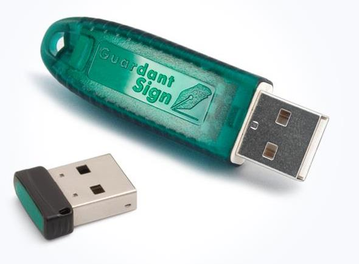

# Варианты исполнения ключа

Для физических ключей доступны два варианта исполнения: стандартный и микро.

Для локального ключа доступны оба варианта исполнения, но сетевой ключ доступен только в стандартном форм-факторе.

## Сравнение вариантов физических ключей

### Локальный USB-ключ

Особенности:

* Должен быть вставлен в USB-порт того компьютера, на котором будет запускаться Loginom;
* Привязка программного обеспечения осуществляется не к параметрам компьютера, а только к ключу;
* Loginom может запускаться только там, где установлен ключ;
* Loginom не работает при подключении к системе в режиме RDP-сессии.

Достоинства:

* Работает более стабильно и надежно;
* Не может произойти ситуация блокировки лицензии из-за того, что пользователь на другой машине не закрыл приложение Loginom;
* Для работы локального ключа необходимо установить только драйвер, тогда как при использовании сетевого ключа нужен выделенный сервер, на который необходимо проинсталлировать сервер ключей.

### Сетевой USB-ключ

Особенности:

* Должен быть установлен на выделенном сервере, на котором необходимо дополнительно проинсталлировать сервер ключей;
* Лицензии конкурентные, то есть ограничивается количество компьютеров (или сессий терминала), на которых запущены приложения Loginom.

Достоинства:

* Для работы Loginom нет необходимости устанавливать драйвер на каждую машину, достаточно просто инсталлировать программу;
* Конкурентные лицензии позволяют приобретать меньшее количество ПО в связи с тем, что количество одновременно запущенных приложений ограничивается. Это особенно удобно при работе в корпоративной сети, так как чаще всего Loginom запускают сразу не все пользователи, у которых он установлен.
